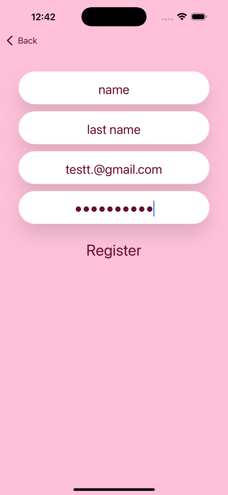
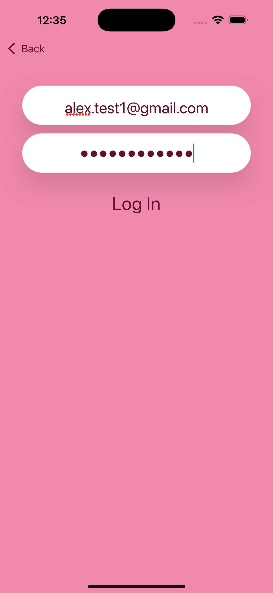
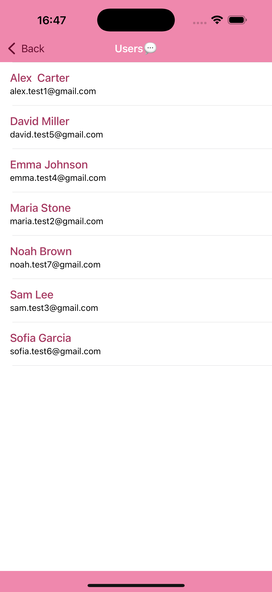
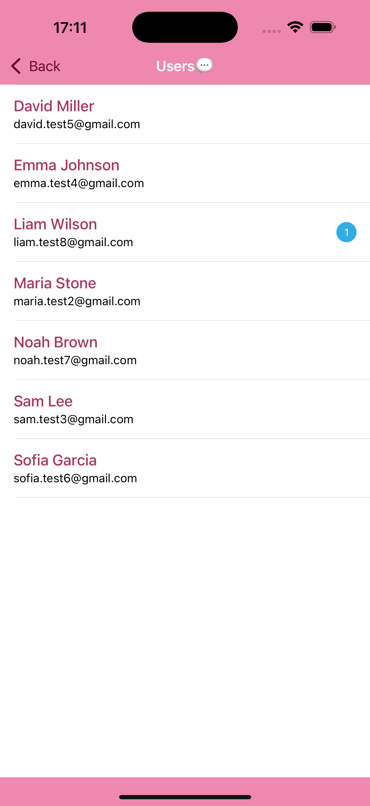
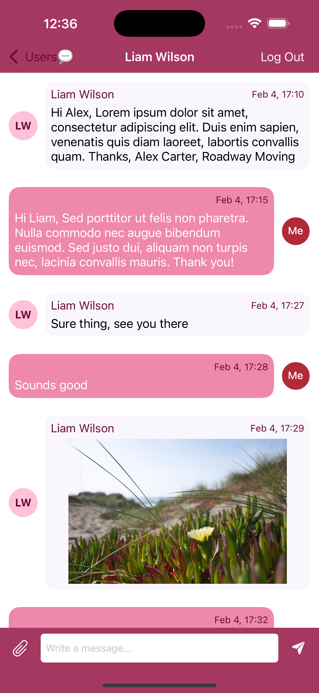
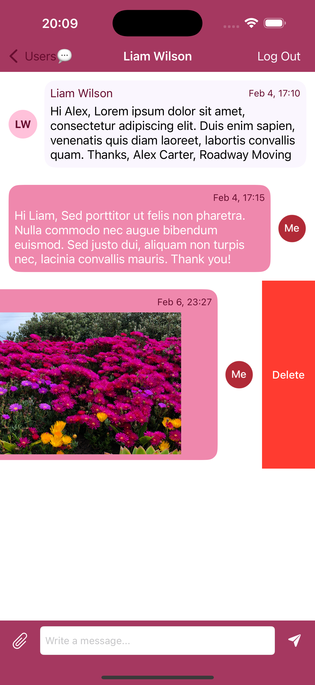

<p align="center">
  
</p>

# 💬 Chatmosphere

Chatmosphere is a real-time iOS chat application built with UIKit and Firebase, supporting text and image messaging with a clean, modern UI.

## ✨ Features

## 🔐 User Authentication
- Register & Login with email and password
- All fields are required and validated
- Test emails are used (not real personal accounts)

## 👥 Users List
- Displays all registered users
- Sorted alphabetically by first name
- Shows unread message count per user

## 💬 Real-Time Chat
- Send and receive text messages instantly
- Send image messages from photo library
- Messages update live using Firestore listeners

## 🖼 Image Messages
- Images are uploaded to Firebase Storage
- Automatically resized while keeping aspect ratio
- Smooth loading using Kingfisher

## 🧹 Delete Messages
- Any message (text or image) can be deleted
- Image messages are removed from both Firestore and Firebase Storage
- UI updates instantly without affecting other messages

## 🧑‍🎨 User Avatars
- Message bubbles display a circular avatar
- Avatar uses the first letter of the first name and last name

## 📖 Read Status
- Messages are automatically marked as read when opened

## 📱 Screenshots

<p align="center">
  
  
  
</p>

<p align="center">
  
  
  
</p>

## 🛠 Tech Stack
- UIKit
- Firebase Authentication
- Firebase Firestore
- Firebase Storage
- Kingfisher (image loading & caching)
- IQKeyboardManager

## 🚀 Getting Started
- Clone the repository
- Install dependencies:
   ```bash
   pod install
- Add your own GoogleService-Info.plist
- Open the .xcworkspace file
- Run the app on a simulator or device

